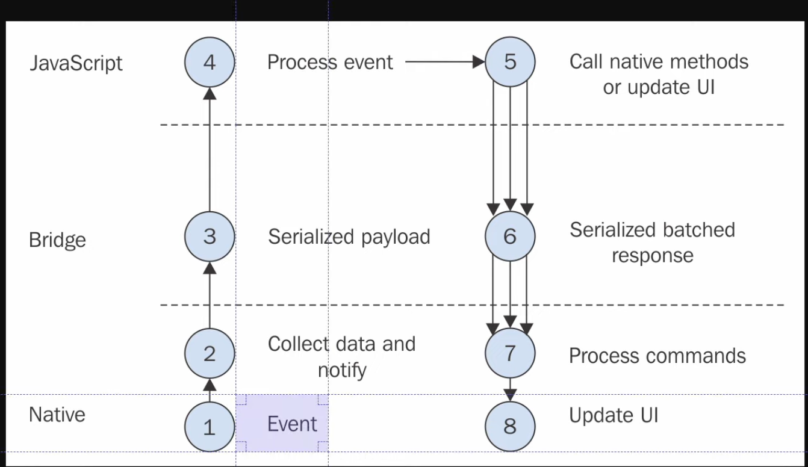

> 출처 : 왕초보를 위한 React Native 101(저자: 니꼬)

# 1.INTRODUCTION

## Welcome

## Requirements
- ReactJS

## Software Requirements
- node 

## Installing Requirements
- Expo
  * 작성한 코드의 결과를 앱에서 즉시 확인
  * 시뮬레이터나 Java, Xcode 같은 것을 설치하지 않아도됨
  * Expo 다운로드 (플레이스토어, 앱스토어) 

### Get started https://docs.expo.dev/
#### Installation
- Node.js
- Git
- Watchman (for Linux or macOS user): 폴더나 파일을 감시하고 있다가, 변화가 생기면 자동으로 원하는 기능을 실행 할 수 있도록 하는 프로그램
  * `brew install watchman`

#### Expo go
- Expo Go는 프로덕션 수준의 앱을 구축하는 데 권장되지 않습니다. 
- 대신 개발 빌드를 사용하세요. 또한 앱 배포/배포 에도 권장되지 않습니다 .
- `npx expo start`프로젝트를 실행하면 Expo CLI가 개발 서버를 시작 하고 QR 코드를 생성합니다. 
- Android에서는 기기에서 Expo Go 앱을 열고 QR 코드를 스캔하여 개발 서버에 연결할 수 있습니다.

#### Create a project
- 프로젝트 초기화: `npx create-expo-app my-app`
- 개발 서버 시작: `npx expo start`
- QR CODE 스캔

## How Does React Native Work
- React Native는 인터페이스로, 운영체제 (iOS, 안드로이드) 사이에 있음
- React Native 코드는 iOS 또는 Java 안드로이드 코드로 번역됨
- React Native 코드를 작성하면 bridge를 통해 안드로이드, iOS에 말을 해줌
- 

## Create The App

## Recap
