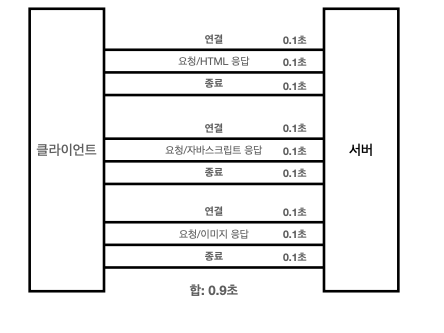
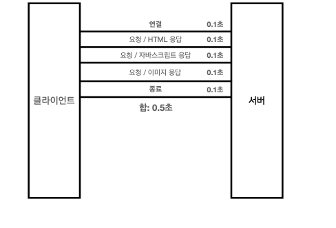
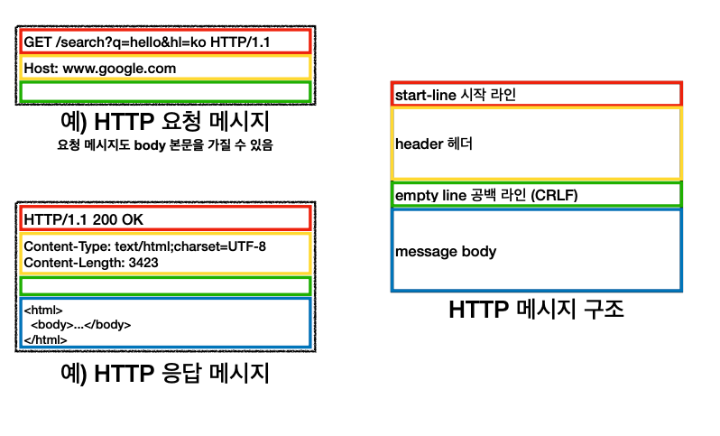

> 출처 : 인프런 모든 개발자를 위한 HTTP 웹 기본 지식 (이영한)

# 3.HTTP 기본

## 모든 것이 HTTP (HyperText Transfer Protocol)

- HTML, TEXT
- IMAGE, 음성, 영상, 파일
- JSON, XML (API)
- 거의 모든 형태의 데이터 전송 가능
- 서버간에 데이터를 주고 받을 때도 대부분 HTTP 사용 지금은 HTTP 시대!

### HTTP 역사

- HTTP/0.9 1991년: GET 메서드만 지원, HTTP 헤더X
- HTTP/1.0 1996년: 메서드, 헤더 추가
- HTTP/1.1 1997년: 가장 많이 사용, 우리에게 가장 중요한 버전
- RFC2068 (1997) -> RFC2616 (1999) -> RFC7230~7235 (2014) HTTP/2 2015년: 성능 개선
- HTTP/3 진행중: TCP 대신에 UDP 사용, 성능 개선

### 기반 프로토콜

- TCP: HTTP/1.1, HTTP/2
- UDP: HTTP/3
- 현재 HTTP/1.1 주로 사용
    * HTTP/2, HTTP/3도 점점 증가

### HTTP 특징

- 클라이언트 서버 구조
- 무상태 프로토콜(스테이스리스), 비연결성
- HTTP 메시지
- 단순함, 확장 가능

## 클라이언트 서버 구조

- Request Response 구조
- 클라이언트는 서버에 요청을 보내고, 응답을 대기
- 서버가 요청에 대한 결과를 만들어서 응답

## Stateful, Stateless

### 무상태 프로토콜 스테이스리스(Stateless)

- 서버가 클라이언트의 상태를 보존X
- 장점: 서버 확장성 높음(스케일 아웃)
- 단점: 클라이언트가 추가 데이터 전송

### Stateful, Stateless 차이 정리

- 상태 유지: 중간에 다른 점원으로 바뀌면 안된다.
  (중간에 다른 점원으로 바뀔 때 상태 정보를 다른 점원에게 미리 알려줘야 한다.)
- 무상태: 중간에 다른 점원으로 바뀌어도 된다.
    * 갑자기 고객이 증가해도 점원을 대거 투입할 수 있다.
    * 갑자기 클라이언트 요청이 증가해도 서버를 대거 투입할 수 있다.
- 무상태는 응답 서버를 쉽게 바꿀 수 있다. -> 무한한 서버 증설 가능

### Stateless 실무 한계

- 모든것을무상태로설계할수있는경우도있고없는경우도있다.
- 무상태
    * 예)로그인이필요없는단순한서비스소개화면
- 상태 유지
    * 예) 로그인
- 로그인한 사용자의 경우 로그인 했다는 상태를 서버에 유지
- 일반적으로 브라우저 쿠키와 서버 세션등을 사용해서 상태 유지
- 상태 유지는 최소한만 사용

## 비 연결성(connectionless)
- HTTP는 기본이 연결을 유지하지 않는 모델 
- 일반적으로 초 단위의 이하의 빠른 속도로 응답
- 1시간 동안 수천명이 서비스를 사용해도 실제 서버에서 동시에 처리하는 요청은 수십개 이 하로 매우 작음
  * 예) 웹 브라우저에서 계속 연속해서 검색 버튼을 누르지는 않는다. 
- 서버 자원을 매우 효율적으로 사용할 수 있음

### 비 연결성 한계와 극복
- TCP/IP 연결을 새로 맺어야 함 - 3 way handshake 시간 추가
- 웹 브라우저로 사이트를 요청하면 HTML 뿐만 아니라 자바스크립트, css, 추가 이미지 등
등 수 많은 자원이 함께 다운로드
- 지금은 HTTP 지속 연결(Persistent Connections)로 문제 해결 
- HTTP/2, HTTP/3에서 더 많은 최적화

### HTTP 초기 - 연결, 종료 낭비


### HTTP 지속 연결(Persistent Connections)


## HTTP 메시지


### 시작 라인: 요청메시지
```http request
GET /search?q=hello&hl=ko HTTP/1.1
Host: www.google.com

```
- start-line = **request-line** / status-line
- request-line = method SP(공백) request-target SP HTTP-version CRLF(엔터)

### 시작라인: 응답메시지
```http request
HTTP/1.1 200 OK
Content-Type: text/html;charset=UTF-8
Content-Length: 3423

<html>
<body>...</body>
</html>
```
- start-line = request-line / **status-line**
- status-line = HTTP-version SP status-code SP reason-phrase CRLF

### HTTP 헤더
- header-field = field-name ":" OWS field-value OWS (OWS:띄어쓰기 허용)
- HTTP 전송에 필요한 모든 부가정보
- 예) 메시지 바디의 내용, 메시지 바디의 크기, 압축, 인증, 요청 클라이언트(브라우저) 정보, 서버 애플리케이션 정보, 캐시 관리 정보... 
- 표준 헤더가 너무 많음 
- [https://en.wikipedia.org/wiki/List_of_HTTP_header_fields](https://en.wikipedia.org/wiki/List_of_HTTP_header_fields)
- 필요시 임의의 헤더 추가 가능

### HTTP 메시지 바디
- 실제 전송할 데이터
- HTML 문서, 이미지, 영상, JSON 등등 byte로 표현할 수 있는 모든 데이터 전송 가능

### 단순함 확장 가능
- HTTP는 단순하다. 스펙도 읽어볼만..(추천X)
- HTTP 메시지도 매우 단순
- 크게 성공하는 표준 기술은 단순하지만 확장 가능한 기술

### HTTP 정리
- HTTP 메시지에 모든 것을 전송
- HTTP 역사 HTTP/1.1을 기준으로 학습
- 클라이언트 서버 구조
- 무상태 프로토콜(스테이스리스)
- HTTP 메시지
- 단순함, 확장가능
- 지금은 HTTP 시대
