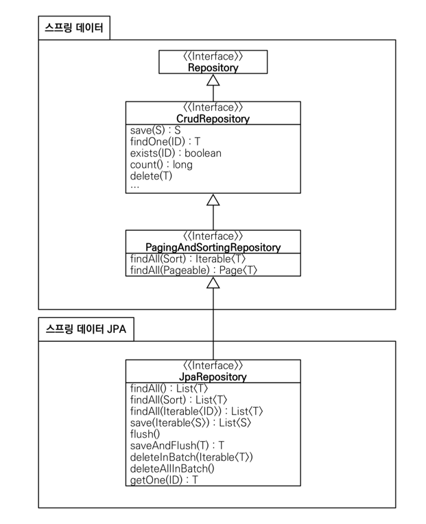

> 출처 : 인프런  실전! 스프링 데이터 JPA(이영한)

# 3.공통 인터페이스 기능
## 순수 JPA 기반 리포티토리 만들기
- 기본 CRUD
  * 저장
  * 변경 변경감지 사용 삭제
  * 전체 조회
  * 단건 조회
  * 카운트

## 공통 인터페이스 설정
- **JavaConfig 설정- 스프링 부트 사용시 생략 가능** 
```java
@Configuration
@EnableJpaRepositories(basePackages = "jpabook.jpashop.repository")
public class AppConfig {}
```
- 스프링 부트 사용시 `@SpringBootApplication` 위치를 지정(해당 패키지와 하위 패키지 인식)
- 만약 위치가 달라지면 `@EnableJpaRepositories` 필요

### **스프링 데이터 JPA가 구현 클래스 대신 생성**
-  `org.springframework.data.repository.Repository` 를 구현한 클래스는 스캔 대상
  * MemberRepository 인터페이스가 동작한 이유
  * 실제 출력해보기(Proxy)
  * memberRepository.getClass() class com.sun.proxy.$ProxyXXX
- `@Repository` 어노테이션 생략 가능
  * 컴포넌트 스캔을 스프링 데이터 JPA가 자동으로 처리
  * JPA 예외를 스프링 예외로 변환하는 과정도 자동으로 처리

## 공통 인터페이스 적용
### **스프링 데이터 JPA 기반 MemberRepository**
```java
public interface MemberRepository extends JpaRepository<Member, Long> {
 }
```
## 공통 인터페이스 분석
- JpaRepository 인터페이스: 공통 CRUD 제공
- 제네릭은 <엔티티 타입, 식별자 타입> 설정

### **공통 인터페이스 구성**

- `T findOne(ID)` -> `Optional<T> findById(ID)` 변경
- `boolean exists(ID)` -> `boolean existsById(ID)` 변경

### 제네릭 타입
- `T`: 엔티티
- `ID`: 엔티티의 식별자 타입
- `S`: 엔티티와 그 자식 타입

### 주요메서드
- `save(S)`: 새로운 엔티티는 저장하고 이미 있는 엔티티는 병합한다.
- `delete(T)`: 엔티티 하나를 삭제한다. 내부에서 `EntityManager.remove()` 호출
- `findById(ID)`: 엔티티 하나를 조회한다. 내부에서 `EntityManager.find()` 호출
- `getOne(ID)`: 엔티티를 프록시로 조회한다. 내부에서 `EntityManager.getReference()` 호출
- `findAll(...)`: 모든 엔티티를 조회한다. 정렬(Sort)이나 페이징(Pageable) 조건을 파라미터로 제공할 수 있다.
