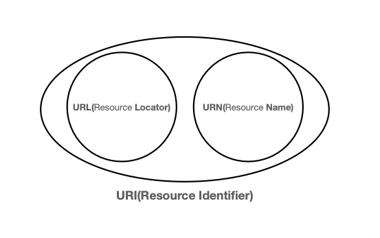
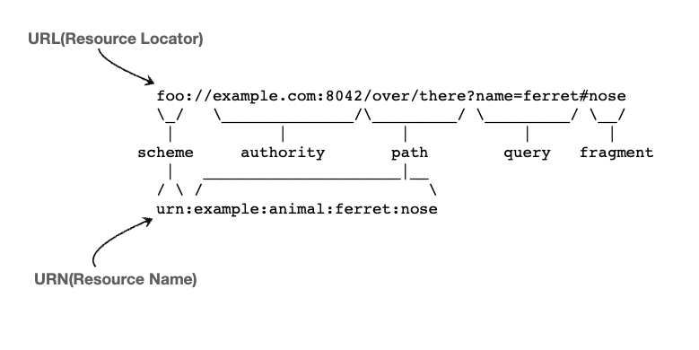

> 출처 : 인프런 모든 개발자를 위한 HTTP 웹 기본 지식 (이영한)

# 2.URI
## URI (Uniform Resource Identifier)
- URI는 로케이터(locator), 이름(name) 또는 둘다 추가로 분류될 수 있다.


- 거의 URL 만 씀

### URI 단어 뜻
- Uniform: 리소스 식별하는 통일된 방식
- Resource: 자원, URI로 식별할 수 있는 모든 것(제한 없음) 
- Identifier: 다른 항목과 구분하는데 필요한 정보
- URL: Uniform Resource Locator 
- URN: Uniform Resource Name

### URL 전체 문법
- `scheme://[userinfo@]host[:port][/path][?query][#fragment]`
- `https://www.google.com:443/search?q=hello&hl=ko`

- 프로토콜(https)
- 호스트명(www.google.com)
- 포트 번호(443)
- 패스(/search)
- 쿼리 파라미터(q=hello&hl=ko)

#### scheme
- 주로 프로토콜 사용
- 프로토콜: 어떤 방식으로 자원에 접근할 것인가 하는 약속 규칙, 예) http, https, ftp 등등
- http는 80 포트, https는 443 포트를 주로 사용, 포트는 생략 가능

#### userinfo
- URL에 사용자정보를 포함해서 인증
- 거의 사용하지 않음

#### host
- 호스트명
- 도메인명 또는 IP 주소를 직접 사용가능

#### port
- 접속포트
- 일반적으로 생략, 생략시 http는 80, https 443

#### path
- 리소스 경로(path), 계층적 구조
- /home.file1.jpg
- /members
- /members/100, /items/iphone12

#### query
- key=value 형태
- ?로 시작, &로 추가 가능 ?keyA=valueA&keyB=valueB
- query parameter, query string 등으로 불림, 웹서버에 제공하는 파라미터, 문자 형태

#### fragment
- html 내부 북마크 등에 사용
- 서버에 전송하는 정보 아님

## 웹 브라우저 요청 흐름
- `https://www.google.com:443/search?q=hello&hl=ko`
- HTTP 요청 메시지 
```http request
GET /search?q=hello&hl=ko HTTP/1.1
Host: www.google.com

```
