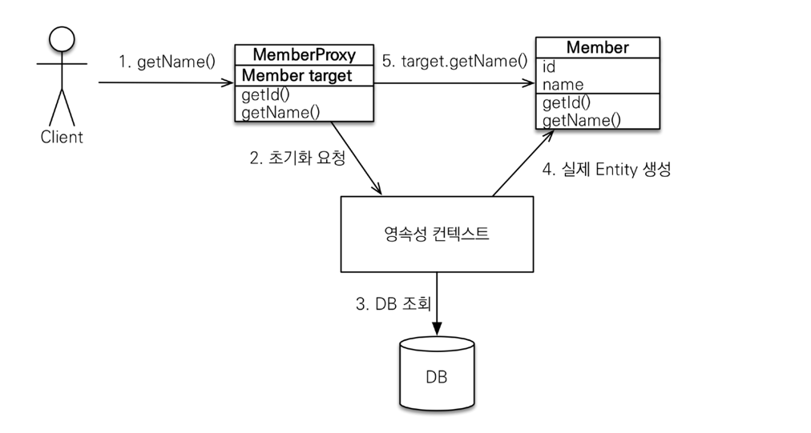

> 출처 : 자바 ORM 표준 JPA 프로그래밍 - 기본편(이영한)

# 8.프록시와 연관관계 관리
## 프록시
### 프록시 기초
- `em.find()` vs `em.getReference()`
- `em.find()`: 데이터베이스를 통해서 실제 엔티티 객체 조회
- `em.getReference()`: 데이터베이스 조회를 미루는 가짜(프록시) 엔티티 객체 조회

### 프록시 특징
- 실제 클래스를 상속 받아서 만들어짐
- 실제 클래스와 겉 모양이 같다.
- 사용하는 입장에서는 진짜 객체인지 프록시 객체인지 구분하지 않고 사용하면 됨(이론상)
- 프록시 객체는 실제 객체의 참조(target)를 보관
- 프록시 객체를 호출하면 프록시 객체는 실제 객체의 메소드 호출

### 프록시 객체의 초기화
```java
Member member = em.getReference(Member.class, "id1");
member.getName();
```


### 프록시의 특징
- 프록시 객체는 처음 사용할때 한번만 초기화
- 프록시 객체를 초기화 할 때, 프록시 객체가 실제 엔티티로 바뀌는 것은 아님, 초기화되면 프록시 객체를 통해서 실제 엔티티에 접근가능
- 프록시 객체는 원본 엔티티를 상속받음, 따라서 타입 체크시 주의해야함(== 비교 실패, 대신 instance of 사용)
- 영속성 컨텍스트에 찾는 엔티티가 이미 있으면 `em.getReference()`를 호출해도 실제 엔티티 반환
```java
Member findMember = em.find(Member.class, member.getId());
System.out.println("findMember = "  + findMember.getClass());

Member refMember = em.getReference(Member.class, member.getId());
System.out.println("refMember = " + refMember.getClass());

System.out.println("findMember == refMember:" + (findMember == refMember));

// 결과
// findMember = class hellojpa.Member
// refMember = class hellojpa.Member
// findMember == refMember: true
```
- 처음에 proxy로 조회하면 em.find로 해도 그냥 proxy로 객체 반환함.
```java
Member refMember = em.getReference(Member.class, member.getId());
System.out.println("refMember = " + refMember.getClass());

Member findMember = em.find(Member.class, member.getId());
System.out.println("findMember = "  + findMember.getClass());

System.out.println("findMember == refMember:" + (findMember == refMember));
// 결과
// findMember = class hellojpa.Member&HibernateProxy&L41zv50Q
// refMember = class hellojpa.Member&HibernateProxy&L41zv50Q
// findMember == refMember: true
```
- **JPA에서는 실제든 프록시든 상관없이 한 영속성 컨텍스트에서 가져온놈이고 PK가 동일하다면 == 비교는 항상 true가 되어야 한다.**
- **개발할때 이게 프록시든 아니든 개발에 크게 문제가 없게 개발하는게 중요**
- 실무에선 em.getReference 쓸일이 거의 없음.
- 영속성 컨텍스트에 도움을 받을 수 없는 준영속 상태일 때, 프록시 객체를 초기화하면 문제 발생
  (하이버 네이트는 org.hibernate.LazyInitialzationException 예외를 터트림)
```java
Member refMember = em.getReference(Member.class, member.getId());
System.out.println("refMember = " + refMember.getClass());

em.detach(refMember);
refMember.getName(); // org.hibernate.LazyInitialzationException 예외 발생
```

### 프록시 확인
- 프록시 인스턴스의 초기화 여부 확인: `PersistenceUnitUtil.isLoaded(Object entity);` `emf.getPersistenceUnitUtil().isLoaded(Object entity);`로 가져욤
- 프록시 클래스 확인방법: `entity.getClass().getName();` 출력
- 프록시 강제 초기화: `org.hibernate.Hibernate.initialize(entity);`
- 참고: JPA 표준은 강제 초기화 없음.

## 즉시 로딩과 지연로딩
### 지연 로딩 LAZY을 사용해서 프록시로 조회
```java
@Entity
public class Member {
    @Id
    @GeneratedValue
    private Long id;
    
    @Column(name = "USERNAME")
    private String name;
    
    @ManyToOne(fetch = FetchType.LAZY) //** @JoinColumn(name = "TEAM_ID")
    private Team team;
    //..
}

Team team = member.getTeam();
team.getName(); // 실제 team을 사용하는 시점에 초기화(DB 조회)
```
### 즉시 로딩 EAGER를 사용해서 함께 조회
```java
@Entity
public class Member {
    @Id
    @GeneratedValue
    private Long id;
  
    @Column(name = "USERNAME")
    private String name;
    
    @ManyToOne(fetch = FetchType.EAGER) //** @JoinColumn(name = "TEAM_ID")
    private Team team;
    //..
}

```
- 즉시 로딩(EAGER), Member조회시 항상 Team도 조회
- JPA 구현체는 가능하면 조인을 사용해서 SQL 한번에 함께 조회

### 프록시와 즉시로딩 주의
- **가급적 지연 로딩만 사용(특히 실무에서)**
- 즉시 로딩을 적용하면 예상하지 못한 SQL이 발생
  * 테이블이 10개 되면 10개 다 끌어옴.  
- **즉시 로딩은 JPQL에서 N+1 문제를 일으킨다.**
```java
List<Member> members = em.createQuery("select m from Member m, Member.class").getResultList();

// 쿼리가 N+1 번나감. 결과데이터 만큼 EAGER로 설정된 team을 조회하는 쿼리가 N번 나감.
```
  * 해걸책1: JPQL 패치 조인 사용 `select m from Member m join fetch m.tem, Member.class`. 한방쿼리로 조인해서 다가져옴
  * 해결책2: 엔티티 그래프라고 어노테이션으로 푸는방법 (뒤에서 설명)
  * 해결책3: 배치사이즈라고 해서 또 다르게 푸는방법(뒤에서 설명)
- **@ManyToOne, @OneToOne은 기본이 즉시 로딩 -> LAZY로 설정**
- @OneToMany, @ManyToMany는 기본이 지연 로딩

### 지연 로딩 활용 - 실무
- **모든 연관관계에 지연 로딩을 사용해라!**
- **실무에서 즉시 로딩을 사용하지 마라!**
- **JPQL fetch 조인이나, 엔티티 그래프 기능을 사용해라!(뒤에서 설명)**
- 즉시 로딩은 상상하지 못한 쿼리가 나간다.

## 영속성 전이(CASCADE)와 고아 객체
- 즉시로딩, 지연로딩, 연관관계 세팅과 전혀 관계가 없다.
- 특정 엔티티를 영속 상태로 만들 때 연관된 엔티티도 함께 영속 상태로 만들도 싶을 때
- 예: 부모 엔티티를 저장할 때 자식 엔티티도 함께 저장

### 영속성 전이: 저장
- `@OneToMany(mappedBy="parent", cascade=CascadeType.PERSIST)`

### 영속성 전이 : CASCADE - 주의!
- 영속성 전이는 연관관계를 매핑하는 것과 아무 관련이 없음
- 엔티티를 영속화할 때 연관된 엔티티도 함께 영속화하는 편리함을 제공할 뿐
- 사용가능할때
  * 라이프사이클이 거의 유사할때
  * 단일 소유자. 소유자가 하나일때
- 사용하면 안될때: 다른 엔티티가 이 차일드랑 연관관계까 있을때

### CASCADE의 종류
- **ALL: 모두적용**
- **PERSIST: 영속**
- **REMOVE: 삭제**
- MERGE: 병합
- REFRESH: REFRESH
- DETACH: DETACH
- ALL 또는 Persist사용. 삭제하면 안될 때 조힘해야 될 때는 딱 Persist. 아니면 ALL 

### 고아객체
- 고아 객체 제거: 부모 엔티티와 연관관계가 끊어진 자식 엔티티 를 자동으로 삭제
- `orphanRemoval = true`
```java
Parent parent1 = em.find(Parent.class, id);
parent1.getChildren().remove(0); // 자식 엔티티를 컬렉션에서 제거

// DELETE FROM CHILE WHERE ID = ? DB에서도 제거됨
```

### 고아 객체 - 주의
- 참조가 제거된 엔티티는 다른 곳에서 참조하지 않는 고아 객체로 보고 삭제하는 기능
- **참조하는 곳이 하나일 때 사용해야함!**
- **특정 엔티티가 개인 소유할 때 사용**
- `@OnoToOne`, `@OneToMany`만 가능
- 참고: 개념적으로 부모를 제거하면 자식은 고아가 된다. 따라서 고아 객체 제거 기능을 활성화하면,
부모를 제거할 때 자식도 함께 제거된다. 이것은 CascadeType.REMOVE처럼 동작한다.

### 영속성 전이 + 고아 객체, 생명주기
- **CascadeType.ALL + orphanRemoval=true**
- 스스로 생명주기를 관리하는 엔티티는 em.persist()로 영속화, em.remove()로 제거
- 두 옵션을 모두 활성화 하면 부모 엔티티를 통해서 자식의 생명주기를 관리할 수 있음
- 도메인 주도 설계(DDD)의 Aggregate Root 개념을 구현할 때 유용

## 실전 예제 5 - 연관관계 관리
### 글로벌 페치 전략 설정
- 모든 연관관계를 지연 로딩으로
- @ManyToOne, @OneToOne은 기본이 즉시 로딩이므로 지연 로딩으로 변경

### 영속성 전이 설정
- Order -> Delivery를 영속성 전이 ALL 설정
- Order -> OrderItem을 영속성 전이 ALL 설정
