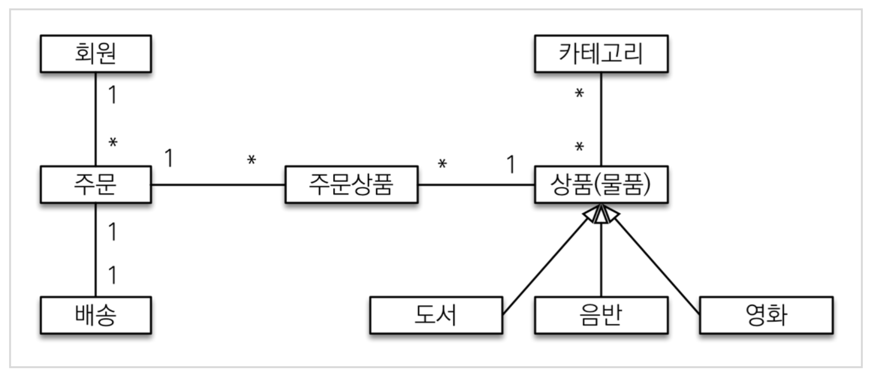
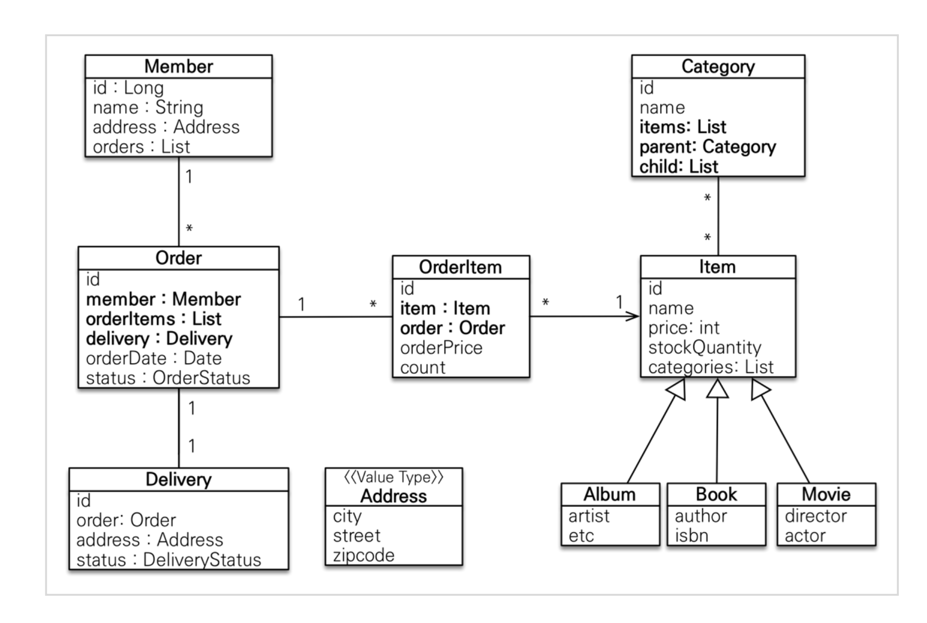
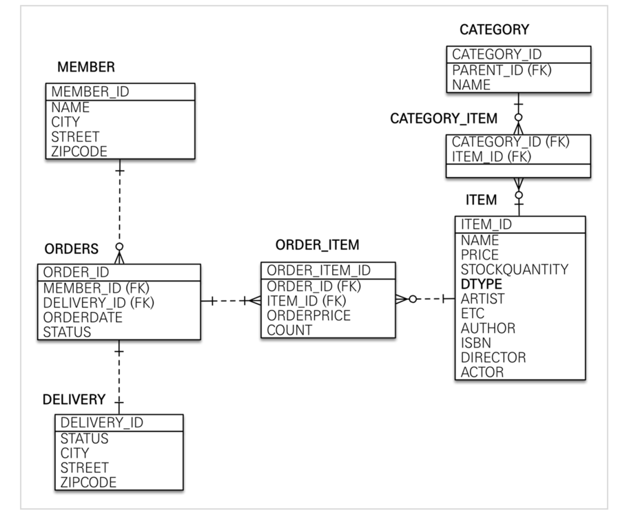

> 출처 : 인프런  실전! 스프링 부트와 JPA 활용1 - 웹 애플리케이션 개발(이영한)

# 2.도메인 분석 설계
## 요구사항 분석
- 회원 기능 
  * 회원 등록
  * 회원 조회 
- 상품 기능
  * 상품 등록
  * 상품 수정
  * 상품 조회
- 주문 기능 
  * 상품 주문
  * 주문 내역 조회
  * 주문 취소
- 기타 요구사항
  * 상품은 재고 관리가 필요하다.
  * 상품의 종류는 도서, 음반, 영화가 있다. 
  * 상품을 카테고리로 구분할 수 있다. 
  * 상품 주문시 배송 정보를 입력할 수 있다.
  
## 도메인 모델과 테이블 설계

- 회원, 주문, 상품의 관계
  * 회원은 여러 상품을 주문할 수 있다. 
  * 그리고 한 번 주문할 때 여러 상품을 선택할 수 있으므로 주문과 상품은 다대다 관계다. 
  * 하지만 이런 다대다 관계는 관계형 데이터베이스는 물론이고 엔티 티에서도 거의 사용하지 않는다. 
  * 따라서 그림처럼 주문상품이라는 엔티티를 추가해서 다대다 관계를 일대 다, 다대일 관계로 풀어냈다.
- 상품 분류: 상품은 도서, 음반, 영화로 구분되는데 상품이라는 공통 속성을 사용하므로 상속 구조로 표현했다.

### 회원 엔티티 분석

- **회원(Member)**: 이름과 임베디드 타입인 주소( Address ), 그리고 주문( orders ) 리스트를 가진다.
- **주문(Order)** 
  * 한 번 주문시 여러 상품을 주문할 수 있으므로 주문과 주문상품( OrderItem )은 일대다 관계다. 
  * 주문은 상품을 주문한 회원과 배송 정보, 주문 날짜, 주문 상태( status )를 가지고 있다. 
  * 주문 상태는 열거형을 사용했는데 주문( ORDER ), 취소( CANCEL )을 표현할 수 있다.
- **주문상품(OrderItem)**: 주문한 상품 정보와 주문 금액( orderPrice ), 주문 수량( count ) 정보를 가지고 있다. (보통 OrderLine , LineItem 으로 많이 표현한다.)
- **상품(Item)**: 이름, 가격, 재고수량( stockQuantity )을 가지고 있다. 상품을 주문하면 재고수량이 줄어든 다. 상품의 종류로는 도서, 음반, 영화가 있는데 각각은 사용하는 속성이 조금씩 다르다.
- **배송(Delivery)**: 주문시 하나의 배송 정보를 생성한다. 주문과 배송은 일대일 관계다.
- **카테고리(Category)**: 상품과 다대다 관계를 맺는다. parent , child 로 부모, 자식 카테고리를 연결한다.
- **주소(Address)**: 값 타입(임베디드 타입)이다. 회원과 배송(Delivery)에서 사용한다.

### 회원 테이블 분석

- ITEM: 앨범, 도서, 영화 타입을 통합해서 하나의 테이블로 만들었다. DTYPE 컬럼으로 타입을 구분한다.

### 연관관계 매핑 분석
- 회원과 주문: 일대다, 다대일의 양방향 관계다. 따라서 연관관계의 주인을 정해야 하는데, 외래 키가 있는 주 문을 연관관계의 주인으로 정하는 것이 좋다. 그러므로 Order.member 를 ORDERS.MEMBER_ID 외래 키와 매핑한다.
- 주문상품과 주문: 다대일 양방향 관계다. 외래 키가 주문상품에 있으므로 주문상품이 연관관계의 주인이다. 그러므로 OrderItem.order 를 ORDER_ITEM.ORDER_ID 외래 키와 매핑한다.
- 주문상품과 상품: 다대일 단방향 관계다. OrderItem.item 을 ORDER_ITEM.ITEM_ID 외래 키와 매핑한 다.
- 주문과 배송: 일대일 양방향 관계다. Order.delivery 를 ORDERS.DELIVERY_ID 외래 키와 매핑한다.
- 카테고리와 상품: @ManyToMany 를 사용해서 매핑한다.(실무에서 @ManyToMany는 사용하지 말자. 여기서는 다대다 관계를 예제로 보여주기 위해 추가했을 뿐이다)

## 엔티티 클래스 개발1
- 예제에서는 설명을 쉽게하기 위해 엔티티 클래스에 Getter, Setter를 모두 열고, 최대한 단순하게 설계 
- 실무에서는 가급적 Getter는 열어두고, Setter는 꼭 필요한 경우에만 사용하는 것을 추천

## 엔티티 클래스 개발2
- **foreign key 거는것은 시스템 마다 다른것 같음.**
- **실시간 트래픽이 엄청 중요하고 정합성 보다는 잘 서비스 되는게 좀 더 유연한게 좋으면 foreign key 빼고 인덱스만 잘 잡아 주면됨**
- **돈과 관련된 너무 중요한거고 데이터가 항상 맞아야 되라고 하면 foreign key를 거는거에 대해서 진지하게 고민해 볼 필요가 있음**
- 예제에서는 설명을 쉽게하기 위해 엔티티 클래스에 Getter, Setter를 모두 열고, 최대한 단순하게 설계 
- 실무에서는 가급적 Getter는 열어두고, Setter는 꼭 필요한 경우에만 사용하는 것을 추천

### 회원엔티티
- 엔티티의 식별자는 id 를 사용하고 PK 컬럼명은 member_id 를 사용했다.
- 엔티티는 타입(여기서는 Member )이 있으므로 id 필드만으로 쉽게 구분할 수 있다.
- 테이블은 타입이 없으므로 구분이 어렵다. 그리 고 테이블은 관례상 테이블명 + id 를 많이 사용한다.
- 참고로 객체에서 id 대신에 memberId 를 사용해도 된다. 중요한 것은 일관성이다.

### 카테고리 엔티티
- 실무에서는 @ManyToMany 를 사용하지 말자
- 중간 엔티티( CategoryItem 를 만들고 @ManyToOne , @OneToMany 로 매핑해서 사용하자. 정리하면 다대다 매핑을 일대다, 다대일 매핑으로 풀어 내서 사용하자.

### 주소 값 타입
- 값 타입은 변경 불가능하게 설계해야 한다.
- @Setter 를 제거하고, 생성자에서 값을 모두 초기화해서 변경 불가능한 클래스를 만들자.
- JPA 스펙상 엔티티나 임베디드 타입( @Embeddable )은 자바 기본 생성자(default constructor)를 public 또는 protected 로 설정해야 한다. public 으로 두는 것 보다는 protected 로 설정하는 것이 그나마 더 안전 하다.
- JPA가 이런 제약을 두는 이유는 JPA 구현 라이브러리가 객체를 생성할 때 리플랙션 같은 기술을 사용할 수 있도록 지원해야 하기 때문이다.
```java
@Embeddable
@Getter
public class Address {
    private String city;
    private String street;
    private String zipcode;

    protected Address() {}

    public Address(String city, String street, String zipcode) {
        this.city = city;
        this.street = street;
        this.zipcode = zipcode;
    }
}
```

### 주문엔티티
```java
@OneToMany(mappedBy = "order", cascade = CascadeType.ALL)
private List<OrderItem> orderItems = new ArrayList<>();

@OneToOne(fetch = FetchType.LAZY, cascade = CascadeType.ALL)
@JoinColumn(name = "delivery_id")
private Delivery delivery;
```
- order를 저장할때 연관된 엔티티도 같이 저장해줌

#### 영속성 전이(CASCADE)와 고아 객체
- 즉시로딩, 지연로딩, 연관관계 세팅과 전혀 관계가 없다.
- 특정 엔티티를 영속 상태로 만들 때 연관된 엔티티도 함께 영속 상태로 만들도 싶을 때
- 예: 부모 엔티티를 저장할 때 자식 엔티티도 함께 저장

#### 영속성 전이: 저장
- `@OneToMany(mappedBy="parent", cascade=CascadeType.PERSIST)`

#### 영속성 전이 : CASCADE - 주의!
- 영속성 전이는 연관관계를 매핑하는 것과 아무 관련이 없음
- 엔티티를 영속화할 때 연관된 엔티티도 함께 영속화하는 편리함을 제공할 뿐
- 사용가능할때
  * 라이프사이클이 거의 유사할때
  * 단일 소유자. 소유자가 하나일때
- 사용하면 안될때: 다른 엔티티가 이 차일드랑 연관관계가 있을때

#### CASCADE의 종류
- **ALL: 모두적용**
- **PERSIST: 영속**
- **REMOVE: 삭제**
- MERGE: 병합
- REFRESH: REFRESH
- DETACH: DETACH
- ALL 또는 Persist사용. 삭제하면 안될 때 조힘해야 될 때는 딱 Persist. 아니면 ALL

## 엔티티 설계시 주의점
- 자동생성 DDL을 그대로 쓰면 안되고, 자동생성 DDL을 스크립트 가지고 뽑은 다음에 디테일하게 수정할 것들 수정하고 정제해서 사용

### 엔티티에는 가급적 Setter를 사용하지 말자
- Setter가 모두 열려있다. 변경 포인트가 너무 많아서, 유지보수가 어렵다. 
- 나중에 리펙토링으로 Setter 제거

### 모든 연관관계는 지연로딩으로 설정!
- 즉시로딩( EAGER )은 예측이 어렵고, 어떤 SQL이 실행될지 추적하기 어렵다. 
- 특히 JPQL을 실행할 때 N+1 문제가 자주 발생한다.
- 실무에서 모든 연관관계는 지연로딩( LAZY )으로 설정해야 한다.
- 연관된 엔티티를 함께 DB에서 조회해야 하면, fetch join 또는 엔티티 그래프 기능을 사용한다.
- @XToOne(OneToOne, ManyToOne) 관계는 기본이 즉시로딩이므로 직접 지연로딩으로 설정해야 한다.

### 컬렉션은 필드에서 초기화 하자.
- 컬렉션은 필드에서 바로 초기화 하는 것이 안전하다.
- null 문제에서 안전하다.
- 하이버네이트는 엔티티를 영속화 할 때, 컬랙션을 감싸서 하이버네이트가 제공하는 내장 컬렉션으로 변경한다. 
만약 getOrders() 처럼 임의의 메서드에서 컬력션을 잘못 생성하면 하이버네이트 내부 메커니즘에 문 제가 발생할 수 있다. 따라서 필드레벨에서 생성하는 것이 가장 안전하고, 코드도 간결하다.
```java
Member member = new Member();
System.out.println(member.getOrders().getClass());
em.persist(member);
System.out.println(member.getOrders().getClass());

//출력 결과
class java.util.ArrayList
class org.hibernate.collection.internal.PersistentBag
```
### 테이블, 컬럼명 생성 전략
- 스프링 부트에서 하이버네이트 기본 매핑 전략을 변경해서 실제 테이블 필드명은 다름
  * https://docs.spring.io/spring-boot/docs/2.1.3.RELEASE/reference/htmlsingle/#howto-configure-hibernate-naming-strategy
  * https://docs.jboss.org/hibernate/orm/5.4/userguide/html_single/Hibernate_User_Guide.html#naming
- 하이버네이트 기존 구현: 엔티티의 필드명을 그대로 테이블의 컬럼명으로 사용 ( SpringPhysicalNamingStrategy )
- 스프링 부트 신규 설정 (엔티티(필드) 테이블(컬럼))
  * 카멜케이스 -> 언더스코어(memberPoint -> member_point)
  * .(점) -> _(언더스코어)
  * 대문자 -> 소문자

### 적용 2단계
- 1.논리명 생성: 명시적으로 컬럼, 테이블명을 직접 적지 않으면 ImplicitNamingStrategy 사용
  * `spring.jpa.hibernate.naming.implicit-strategy` : 테이블이나, 컬럼명을 명시하지 않을 때 논리명 적용,
- 2.물리명 적용
  * `spring.jpa.hibernate.naming.physical-strategy` : 모든 논리명에 적용됨(테이블 명이 적혀있든 적혀있지 않던 1차적용된 논리명에 2차적용), 실제 테이블에 적용 (username usernm 등으로 회사 룰로 바꿀 수 있음)

### 스프링 부트 기본 설정
```properties
spring.jpa.hibernate.naming.implicit-strategy: org.springframework.boot.orm.jpa.hibernate.SpringImplicitNamingStrategy
spring.jpa.hibernate.naming.physical-strategy: org.springframework.boot.orm.jpa.hibernate.SpringPhysicalNamingStrategy 
```
- 적용할 룰이 있으면 해당 클래스 참조해서 구현하면됨

### 연관관계 편의 메서드
```java
    // == 연관관계 메시드 == //
    public void setMember(Member member) {
        this.member = member;
        member.getOrders().add(this);
    }

    public void addOrderItem(OrderItem orderItem) {
        this.orderItems.add(orderItem);
        orderItem.setOrder(this);
    }

    public void setDelivery(Delivery delivery) {
        this.delivery = delivery;
        delivery.setOrder(this);
    }
}
```
