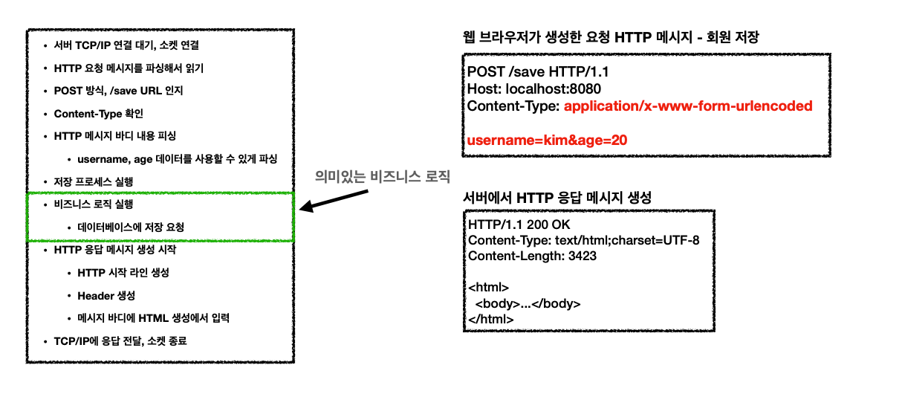
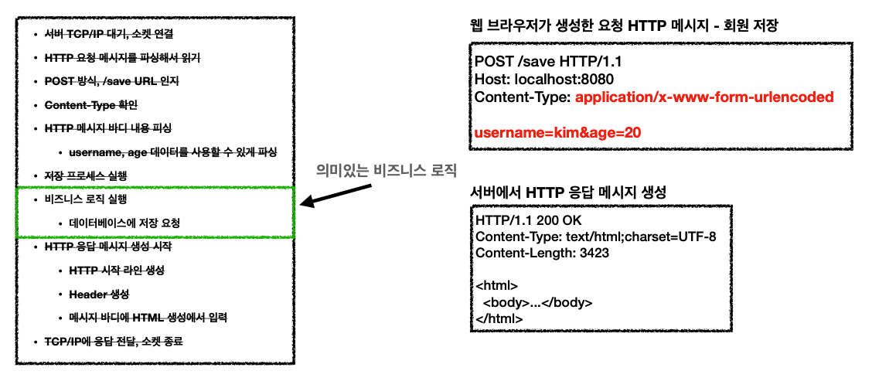
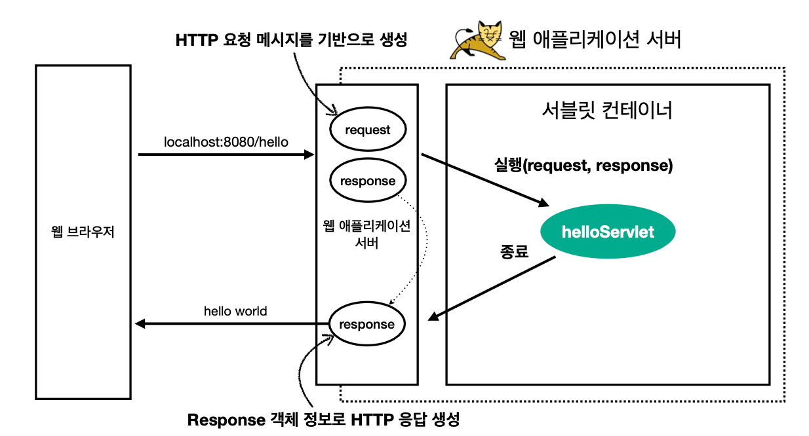

> 출처 : 스프링 MVC 1편 - 백엔드 웹 개발 핵심 기술 (이영한)

# 1.웹 애플리케이션 이해

## 웹 서버, 웹 애플리케이션 서버

### 웹 서버, 웹 애플리케이션 서버(WAS) 차이

- 웹 서버는 정적 리소스(파일), WAS는 애플리케이션 로직
- 사실은 둘의 용어도 경계도 모호함
    * 웹 서버도 프로그램을 실행하는 기능을 포함하기도 함
        * 웹 애플리케이션 서버도 웹 서버의 기능을 제공함
- 자바는 서블릿 컨테이너 기능을 제공하면 WAS
    * 서블릿 없이 자바코드를 실행하는 서버 프레임워크도 있음
- WAS는 애플리케이션 코드를 실행하는데 더 특화

## 서블릿

### 서버에서 처리해야 하는 업무 웹 애플리케이션 서버 직접 구현

### 서버에서 처리해야 하는 업무 서블릿을 지원하는 WAS 사용

### 특징

### 서블릿 HTTP 요청, 응답 흐름

- HTTP 요청시

* WAS는 Request, Response 객체를 새로 만들어서 서블릿 객체 호출
* 개발자는 Request 객체에서 HTTP 요청 정보를 편리하게 꺼내서 사용
* 개발자는 Response 객체에 HTTP 응답 정보를 편리하게 입력
* WAS는 Response 객체에 담겨있는 내용으로 HTTP 응답 정보를 생성

### 서블릿 컨테이너

- 톰캣처럼 서블릿을 지원하는 WAS를 서블릿 컨테이너라고 함
- 서블릿 컨테이너는 서블릿 객체를 생성, 초기화, 호출, 종료하는 생명주기 관리
- 서블릿 객체는 싱글톤으로 관리
    * 고객의 요청이 올 때 마다 계속 객체를 생성하는 것은 비효율
    * 최초 로딩 시점에 서블릿 객체를 미리 만들어두고 재활용
    * 모든 고객 요청은 동일한 서블릿 객체 인스턴스에 접근
    * 공유 변수 사용 주의
    * 서블릿 컨테이너 종료시 함께 종료
- JSP도 서블릿으로 변환 되어서 사용
- 동시 요청을 위한 멀티 쓰레드 처리 지원

## 동시 요청 - 멀티 쓰레드
### 쓰레드 풀 요청 마다 쓰레드 생성의 단점 보완

- 특징
  * 필요한 쓰레드를 쓰레드 풀에 보관하고 관리한다.
  * 쓰레드 풀에 생성 가능한 쓰레드의 최대치를 관리한다. 톰캣은 최대 200개 기본 설정 (변경 가능) 
- 사용
  * 쓰레드가 필요하면, 이미 생성되어 있는 쓰레드를 쓰레드 풀에서 꺼내서 사용한다.
  * 사용을 종료하면 쓰레드 풀에 해당 쓰레드를 반납한다.
  * 최대 쓰레드가 모두 사용중이어서 쓰레드 풀에 쓰레드가 없으면?
    + 기다리는 요청은 거절하거나 특정 숫자만큼만 대기하도록 설정할 수 있다.
- 장점
  * 쓰레드가 미리 생성되어 있으므로, 쓰레드를 생성하고 종료하는 비용(CPU)이 절약되고, 응답 시간이 빠르다.
  * 생성 가능한 쓰레드의 최대치가 있으므로 너무 많은 요청이 들어와도 기존 요청은 안전하게 처리할 수 있다.

### 쓰레드 풀 실무 팁
- WAS의 주요 튜닝 포인트는 최대 쓰레드(max thread) 수이다. 
- 이 값을 너무 낮게 설정하면?
  * 동시 요청이 많으면, 서버 리소스는 여유롭지만, 클라이언트는 금방 응답 지연 
- 이 값을 너무 높게 설정하면?
  * 동시 요청이 많으면, CPU, 메모리 리소스 임계점 초과로 서버 다운 
- 장애 발생시?
  * 클라우드면 일단 서버부터 늘리고, 이후에 튜닝 
  * 클라우드가 아니면 열심히 튜닝

### 쓰레드 풀 쓰레드 풀의 적정 숫자
- 적정 숫자는 어떻게 찾나요?
- 애플리케이션 로직의 복잡도, CPU, 메모리, IO 리소스 상황에 따라 모두 다름 
- 성능 테스트
  * 최대한 실제 서비스와 유사하게 성능 테스트 시도 
  * 툴: 아파치 ab, 제이미터, nGrinder(네이버에서만듬)

## HTML, HTTP API, CSR, SSR
### 어디까지 알아야 하나요? 백엔드 개발자 입장에서 UI 기술
- 백엔드 - 서버 사이드 렌더링 기술
  * JSP, 타임리프
  * 화면이 정적이고, 복잡하지 않을 때 사용
  * 백엔드 개발자는 서버 사이드 렌더링 기술 학습 필수
- 웹 프론트엔드 - 클라이언트 사이드 렌더링 기술
  * React, Vue.js
  * 복잡하고 동적인 UI 사용
  * 웹 프론트엔드 개발자의 전문 분야
- 선택과 집중
  * 백엔드 개발자의 웹 프론트엔드 기술 학습은 옵션
  * 백엔드 개발자는 서버, DB, 인프라 등등 수 많은 백엔드 기술을 공부해야 한다. 
  * 웹 프론트엔드도 깊이있게 잘 하려면 숙련에 오랜 시간이 필요하다.

## 자바 백엔드 웹 기술 역사
### 최신 기술 - 스프링 웹 플럭스(WebFlux)
- 특징
  * 비동기 넌 블러킹 처리
  * 최소 쓰레드로 최대 성능 - 쓰레드 컨텍스트 스위칭 비용 효율화 
  * 함수형 스타일로 개발 - 동시처리 코드 효율화
  * 서블릿 기술 사용X
- 그런데
  * 웹 플럭스는 기술적 난이도 매우 높음
  * 아직은 RDB 지원 부족
  * 일반 MVC의 쓰레드 모델도 충분히 빠르다. 
  * 실무에서 아직 많이 사용하지는 않음 (전체 1% 이하)
