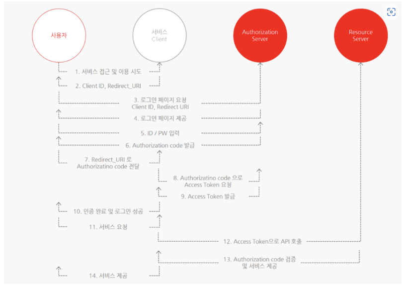

> 출처 : 스프링 시큐리티 인 액션 : 보안 기초부터 OAuth 2까지, 스프링 시큐리티를 활용한 안전한 앱 설계와 구현

# 12. OAuth2가 작동하는 방법
- OAuth2 프레임워크의 주요 구성 요소가 사용자, 클라이언트, 리소스 서버, 권한부여서버 임을 확인한다.
- 참고: https://hudi.blog/oauth-2.0/

## 12.1 OAuth2 프레임워크
- OAuth2 를 권한 부여 프레임워크(또는 사양프레임워크)라고 부르는 경우가 많으며, 타사 웹사이트나 웹이 리소스에 접근할 수 있게 허용하는 거싱 주 목적이다.

## 12.2 OAuth2 인증 아키텍처의 구성 요소
- 리소스 서버: 사용자가 소유한 리소스를 호스팅하는 서버. 리소스는 사용자의 데이터이거나 사용자가 수행할 수 있는 작업일 수 있다.
- 사용자(또는 리소스 소유자): 리소스 서버가 노출하는 리소스를 소유하는 개인, 일반적으로 사용자는 사용자의 이름과 암호로 신원을 증명한다.
- 클라이언트 - 사용자를 대신해 사용자가 소유한 리소스에 접근하는 애플리케이션, 클라이언트는 클라이언트 ID와 클라이언트 비밀을 이용해 신원을 증명한다.
이러한 자격 증명은 사용자 자격 증명과는 다르다는데 주의하자. 클라이언트는 요청할때 자신을 증명하는 자체 자격 증명이 필요하다.
- 권한 부여 서버: 클라이언트가 리소스 서버가 노출하는 사용자의 리소스에 접근할 권한을 부여하는 애플리케이션. 권한 부여 서버는 클라이언트가 사용자 대신 리소스에 접근
권한이 있다고 결정하면 토큰을 발급한다. 클라이언트는 이 토큰을 이용해 권한 부여 서버에서 권한을 받았음을 리소스 서버에 증명한다. 리소스 서버는 유효한 토큰이 있으면
클라이언트가 요청한 리소스에 접근하게 허용한다.

## 12.3 OAuth2를 구현하는 방법 선택
- OAuth2를 이용한다는 것은 권한 부여에 토큰을 이용한다는 뜻이다. 토콘은 액세스 카드와 비슷
- OAuth2는 그랜트(grant)라고 하는 토큰을 얻는 여러 방법을 제공한다. 다음은 선택할 수 있는 가장 일반적인 OAuth2 그랜트 유형이다.
  * 승인 코드
  * 암호
  * 갱신 토큰
  * 클라이언트 자격 증명

### 12.3.1 승인 코드 그랜트 유형의 구현
- 1. 인증요청을 한다.
- 2. 액세스 토큰을 얻는다.
- 3. 보호된 리소스를 호출한다.

#### 1단계: 승인 코드 그랜트 유형으로 인증 요청 수행
#### 2단계: 승인 코드 그랜트 유형으로 액세스 토큰 얻기
#### 3단계: 승인 코드 그랜트 유형으로 보호된 리소스 호출

### 12.3.2 암호 그랜트 유형 구현
#### 1단계: 암호 그랜트 유형으로 액세스 토큰 요청
- grant_type: password 값을 가진다.
- client_id 및 client_secret: 클라이언트가 자신을 인증하기 위한 자격 증명
- scope: 허가된 권한이라고 이해할 수 있다.
- username 및 password: 사용자 자격 증명. 일반 텍스트 형식으로 요청 헤더의 값으로 전송된다.
- 클라이언트는 응답으로 액세스 토큰을 받는다. 이제 클라이언트는 액세스 토큰을 이용해 리소스 서버의 엔드포인트를 호출할 수 있다.

#### 2단계: 암호 그랜트 유형으로 액세스 토근을 이용해 리소스 호출
- 액세스 토큰을 얻은 클라이언트는 이 토큰으로 리소스 서버의 엔드포인트를 호출할 수 있으며 승인 코드 그랜트 유형을 이용할 때와 마찬가지로 권한부여 요청에 액세스 토큰을 추가한다.

### 12.3.3 클라이언트 자격 증명 그랜트 유형 구현
#### 1단계: 클라이언트 자격 증명 그랜트 유형으로 액세스 토큰 얻기
#### 2단계: 클라이언트 자격 증명 그랜트 유형으로 액세스 토큰을 이용해 리소스 호출

### 12.3.4 갱신 토큰으로 새 액세스 토큰 얻기

## 12.4 OAuth2의 허점
- 클라이언트에서 CSRF(사이트 간 위조) 이용
- 클라이언트 자격 증명 도용
- 토큰 재생
- 토큰 하이재킹

## 12.5 간단한 SSO(Single Sign-On) 애플리케이션 구현
### 12.5.1 권한 부여 서버 관리
- 직접 권한 부여 서버를 구현하지 않고 기존의 깃허브를 활용한다.
- https://github.com/settings/applications/new
- 이 예제에서 사용할 OAuth2 그랜트 유형은 승인코드 그랜트 유형이다.
```java
@Configuration
public class ProjectConfig extends WebSecurityConfigurerAdapter {

    @Override
    protected void configure(HttpSecurity http) throws Exception {
        http.oauth2Login();

        http.authorizeRequests()
                .anyRequest().authenticated();
    }

}
```
- `oauth2Login()`은 간단하게 필터 체인에 새 인증 필터를 추가한다.
- 이 경우 `oauth2Login()` 메서드를 호출할 때 프레임워크는 OAuth2LoginAuthenticationFilter를 필터 체인에 추가한다. 이 필터는 요청을 가로채고 OAuth2 인증에 필요한 논리를 적용한다.

### 12.5.3 ClientRegistration 구현
- 지금 상태로 바로 시작하면 주 페이지에 접근할 수 없다. 페이지에 접근할 수 없는 이유는 모든 요청에 대해 사용자가 인증해야 한다고 지정했지만 인증 방법은 제공하지 않았기 때문이다.
- 깃허브가 우리 권한 부여 서버임을 설정해야 한다. 스프링 시큐리티는 여기에 이용할 수 있는 ClientRegistration 계약을 정의한다.
- `ClientRegistraion` 인터페이스는 OAuth2 아키텍처의 클라이언트를 나타내며 다음과 같은 클라이언트의 모든 세부 정보를 정의해야 한다.
  * 클라이언트 ID와 비밀
  * 인증에 이용되는 그랜트 유형
  * 리다렉션 URI
  * 범위

```java
private ClientRegistration clientRegistration() {
    ClientRegistration cr = ClientRegistration.withRegistrationId("github")
            .clientId("a7553955a0c534ec5e6b")
            .clientSecret("1795b30b425ebb79e424afa51913f1c724da0dbb")
            .scope(new String[]{"read:user"})
            .authorizationUri("https://github.com/login/oauth/authorize")
            .tokenUri("https://github.com/login/oauth/access_token")
            .userInfoUri("https://api.github.com/user")
            .userNameAttributeName("id")
            .clientName("GitHub")
            .authorizationGrantType(AuthorizationGrantType.AUTHORIZATION_CODE)
            .redirectUriTemplate("{baseUrl}/{action}/oauth2/code/{registrationId}")
            .build();
    return cr;
}
```
- 권한 부여 URI: 클라이언트가 인증을 위해 사용자를 리다이렉션하는 URL
- 토큰URI - 12.3절에 설명된 대로 클라이언트가 액세스 토큰과 갱신 토큰을 얻기 위해 호출하는 URI
- 사용자 정보 URI - 클라이언트가 액세스 토큰을 얻은 후 사용자의 세부 정보를 얻기 위해 호출하는 URI
- 깃허브 설명서: https://developer.github.com/apps/building-oauth-apps/authorizing-oauth-apps/
- 스프링 시큐리티는 더 편하게 작업할 수 있도록 CommonOAuth2Provider라는 클래스를 정의한다. 이 클래스는 가장 일반적인 공급자에 대한 인증에 이용할 수 있는 
ClientRegistration 인스턴스를 부분적으로 정의한다. (구글, 깃허브, 페이스북, 옥타)
```java
    private ClientRegistration clientRegistration() {
        return CommonOAuth2Provider.GITHUB
            .getBuilder("github")
                .clientId("a7553955a0c534ec5e6b")
                .clientSecret("1795b30b425ebb79e424afa51913f1c724da0dbb")
                .build();
    }
```
- 일반적인 공급자에만 적용된다. 아니라면 ClientRegistration을 완전히 정의하는 것 외에 다른 방법이 없다.

### 12.5.4 ClientRegistrationRepository 구현
- OAuth2LoginAuthenticationFilter 인증 필터는 ClientRegistrationRepository에서 권한 부여 서버 클라이언트 등록에 대한 세부 정보를 얻는다.
- ClientRegistrationRepository에는 하나 이상의 ClientRegistration 객체가 있다.
- 스프링 시큐리티는 ClientRegistration의 인스턴스를 메모리에 저장하는 ClientRegistrationRepository의 구현인 InMemoryClientRegistrationRepository를 제공한다.
```java
@Configuration
public class ProjectConfig extends WebSecurityConfigurerAdapter {
    @Bean
    public ClientRegistrationRepository clientRepository() {
        var c = clientRepository();
        return new InMemoryClientRegistrationRepository(c);
    }
    
    private ClientRegistration clientRegistration() {
        return CommonOAuth2Provider.GITHUB.getBuilder("github")
                .clientId("abdslakjfdslk")
                .clientSecret("laksdfjlkdsafjlkasdfjlkdsafjlkdsjf")
                .build();
    }
    
    @Override
    protected void configure(HttpSecurity http) throws Exception {
        http.oauth2Login();
        
        http.authorizeRequest()
                .anyRequest().authenticated();
    }
}
```
- ClientRegistrationRepository를 스프링 컨텍스트를 빈으로 추가하면 스프링 시큐리티가 문제없이 이를 찾고 이용할 수 있다.
```java
// Customizer를 이용한 ClientRegistrationRepository 구성
@Configuration
public class ProjectConfig extends WebSecurityConfigurerAdapter {
    
    @Override
    protected void configure(HttpSecurity http) throws Exception {
        http.oauth2Login( c -> {
            c.clientRegistrationRepository(clientRepository());
        });
        
        http.authorizeRequests()
                .anyRequest()
                .authenticated();
    }
    
    private ClientRegistrationRepository clientRepository() {
        var c = clientRepository();
        return new InMemoryClientRegistraionRepository(c);
    }
    
    private ClientRegistration clientRegistration() {
        return CommonOAuth2Provider.GITHUB.getBuilder("github")
                .clientId("aldkfjlsakdfj")
                .clientSecret("alkdfjsldkfjldsf")
                .build();
    }
}
```

### 12.5.5 스프링 부트 구성의 순수한 마법
- 스프링 부트에는 속성 파일로 직접 ClientRegistration과 ClientRegistrationRepository 객체를 구축하는 기능이 있다.
- 다음 코드에는 application.properties 파일로 클라이언트 등록을 설정하는 방법이 나온다.
```properties
spring.security.oauth2.client.registration.github.client-id=adslkfjasdlfk
spring.security.oauth2.client.registration.github.client-secret=lsadfjlaksdfjlksdfjlkasdfjlaksdfjlkdsfjlk
```
- ClientRegistartion 및 ClientRegistrationRepository에 관한 세부정보는 스프링 부트가 속성 파일을 바탕으로 자동으로 생성하므로 직접 지정할 필요가 없다.
- 스프링 시큐리티에 알려지지 않은 일반적인 공급자가 아니 다른 공급자를 이용하려면 spring.security.oauth2.client.provider로 시작하는 속성 그룹으로 권한 부여 서버에 관한
세부 정보도 지정해야 한다.

### 12.5.6 인증된 사용자의 세부 정보 얻기
- 스프링 시큐리티에서 인증된 사용자의 세부 정보는 SecurityContext에 저장된다. 인증 프로세스가 끝나면 담당 필터가 Authentication 객체를 SecurityContext에 저장한다.
- 이 경우 Authentication 객체의 구현은 OAuth2AuthenticationToken이며 SecurityContext에서 직접 이를 가져오거나 스프링부트가 앤드포인트의 매개 변수에 주입하게 할 수 있다.
```java
@Controller
public class MainController {

  @GetMapping("/")
  public String main(OAuth2AuthenticationToken token) {
    System.out.println(token.getPrincipal());
    return "main.html";
  }
}
```

### 12.5.7 애플리케이션 테스트

```
https://github.com/login/oauth/authorize?response_type=code
&client_id=xxx
&scope=read:user
&state=YFA5A6hTm_z787fotm_FO6KpVliAhsS2j-IMGGZp-9M%3D
&redirect_uri=http://localhost:8080/login/oauth2/code/github
```
- 위 URL로 사용자를 리다이렉션한다. URL은 깃허브의 CommonOauth2Provider 클래스에서 권한 부여 URL로 구성된다.
- 애플리케이션이 액세스 토큰을 요청할 때 이용하는 승인코드를 깃허브가 제공 
- `http://localhost:8080/login/oauth2/code/github?code=33882fec6dfdecf2242e&state=YFA5A6hTm_z787fotm_FO6KpVliAhsS2j-IMGGZp-9M%3D`

### 요약
- OAuth2 프레임워크는 엔티티가 사용자 대신 리소스에 접근할 수 있게 하는 방법을 기술한다. 애플리케이션에 OAuth2 프레임워크를 이용해 인증 및 권한 부여 논리를 구현할 수 있다.
- 애플리케이션이 액세스 토큰을 얻기 위해 사용할 수 있는 다양한 흐름을 그랜트라고 한다. 시스템 아키텍쳐에 따라 적합한 그랜트 유형을 선택해야한다.
  * 승인 코드 그랜트 유형
  * 암호 그랜트 유형
  * 클라이언트 자격 증명 그랜트 유형
- 스프링 시큐리티는 OAuth2 프레임워크를 지원해서 애플리케이션에서 몇 줄의 코드로 프레임워크를 구성할 수 있다.
- 스프링 시큐리티는 ClientRegistration의 인스턴스를 이용해 권한 부여 서버에서 클라이언트의 등록을 나타낸다.
- 스프링 시큐리티 OAuth2 구현에서 특정 클라이언트 등록을 찾는 책임이 있는 구성요소를 ClientRegistration Repository라고 한다. 
스프링 시큐리티로 OAuth2 클라이언트를 구현할 때는 사용가능한 ClientRegistration이 하나 이상 있는 ClientRegistrationRepository 객체를 정의해야 한다.
