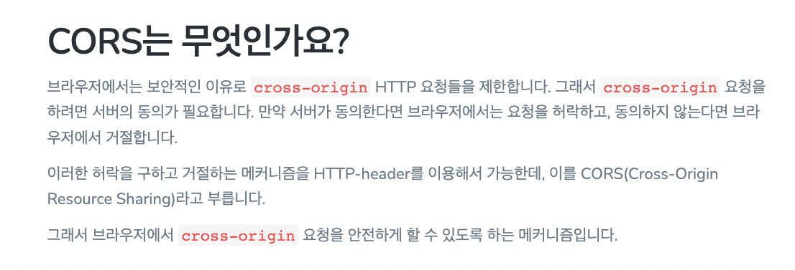

> 출처 : 스프링 시큐리티 인 액션 : 보안 기초부터 OAuth 2까지, 스프링 시큐리티를 활용한 안전한 앱 설계와 구현

# 9.필터 구현
- 스프링 시큐리티의 HTTP 필터는 일반적으로 요청에 적응해야 하는 각 책임을 관리하며 책임의 체인을 형성한다.
- 필터는 요청을 수신하고 그 논리를 실행하며 최종적으로 체인의 다음 필터에 요청을 위임한다.

## 9.1 스프링 시큐리티 아키텍처의 필터 구현
- 스프링 시큐리티 아키텍처의 필터는 일반적인 HTTP 필터다. 필터를 만들려면 javax.servlet 패키지의 Filter 인터페이스를 구현한다. 다른 HTTP 필터와 마찬가지로 doFilter() 메서드를
재정의해 논리를 구현해야 한다. 이 메서드는 `ServletRequest, ServletResponse, FilterChain` 매개 변수를 받는다.
  * `ServletRequest`: HTTP 요청을 나타낸다. ServletRequest 객체를 이용해 요청에 대한 세부 정보를 얻는다.
  * `ServletResponse`: HTTP 응답을 나타낸다. ServletResponse 객체를 이용해 응답을 클라이언트로 다시 보내기 전에 또는 더 나아가 필터 체인에서 응답을 변경한다.
  * `FilterChain`: 필터 체인을 나타낸다. FilterChain 객체는 체인의 다음 필터로 요청을 전달한다.
- 필터 체인은 필터가 작동하는 순서가 정의된 필터의 모음을 나타낸다. 스프링 시큐리티에는 몇 가지 필터 구현과 순서가 있으며 이들 중 몇 가지를 소개하면 다음과 같다.
  * `BasicAuthenticationFilter`는 HTTP Basic 인증을 처리한다.
  * `CsrfFilter`는 CSRF(사이트간 요청 위조)를 처리한다. 
  * `CorsFilter`는 CORS(교차 출처 리소스 공유) 권한 부여 규칙을 처리한다.
    +  
    + >https://hannut91.github.io/blogs/infra/cors
- 필터 체인은 애플리케이션을 구성하는 방법에 따라 더 길어지거나 짧아질 수 있다.
  * 예를 들어 2장과 3장에 HTTP Basic 인증 방식을 이용하려면 HttpSecurity 클래스의 `httpBasic()` 메서드를 호춣해야 한다고 배웠는데, `httpBasic()` 메서드를 호출하면 필터 체인에
  `BasicAuthenticationFilter`가 추가된다.
- 각 필터에는 순서 번호가 있다. 이 순서 번호에 따라 요청에 필터가 적용되는 순서가 결정된다. 스프링 시큐리티가 제공하는 필터와 함께 맞춤형 필터를 추가할 수 있다.

## 9.2 체인에서 기존 필터 앞에 필터 추가
```java
public class RequestValidationFilter implements Filter {
    @Override 
    public void doFilter(ServletRequest servletRequest, ServletResponse servletResponse, FilterChain filterChain) {
        var httpRequest = (HttpServletRequest) servletRequest;
        var httpResponse = (HttpServletResponse) servletResponse;
        
        String requestId = httpRequest.getHeader("Request-Id");
        if (requestId == null || requestId.isBlank()) {
            httpResponse.setStatus(HttpServletResponse.SC_BAD_REQUEST);
            return;
        }
        
        filterChain.doFilter(servletRequest, servletResponse);
    }
}
```
- `Request-Id` 헤더가 있는지 확인하고 헤더가 있으면 doFilter() 메서드를 호출해 체인의 다음 필터로 요청을 전달한다. 헤더가 없으면 필터 체인의 다음 필터로 요청을 전달하지
않고 응답으로 HTTP 상태 '400 잘못된 요청'을 반환한다.
```java
@Configuration
public class ProjectConfig extends WebSecurityConfigurerAdapter {
    
    @Override 
    protected void configure(HttpSecurity http)  throws Exception {
        http.addFilterBefore(new RequestValidationFilter(), BasicAuthenticationFilter.class)
            .authorizeRequests()
                .anyRequest().permitAll();
    }
}
```

## 9.3 체인에서 기존 필터 뒤에 필터 추가
- `addFilterAfter`

## 9.4 필터 체인의 다른 필터 위치에 필터 추가
- 속성 파일에서 정적 키 값을 읽고 Authorization 헤더 값과 같은지 확인한다. 값이 같으면 필터는 요청을 필터 체인의 다음 구성요소에 전달한다.
```java
@Component
public class StaticKeyAuthenticationFilter implements Filter {
    @Value("${authorization.key}")
    private String authorizationKey; // 속성 파일에서 정적 키의 값을 얻음
  
    @Override 
    public void doFilter(ServletRequest request, ServletResponse response, FilterChain filterChain) throws IOException, ServletException {
        var httpRequest = (HttpServletReqeust) request;
        var httpResponse = (HttpServletResponse) response;
        
        String authentication = httpRequest.getHeader("Authorization");
        
        if (authorizationKey.equals(authentication)) {
            filterChain.doFilter(request, response);
        } else {
            httpResponse.setStatus(HttpServletResponse.SC_UNAUTHORIZED);
        }
    }
}
```
- 기존 필터의 위치에 다른 필터를 적용하면 필터가 대체 된다고 생각하는 경우가 많은데 그렇지 않다.
- 스프링 시큐리티는 필터가 실행되는 순서를 보장하지 않는다.
```java
@Configuration
public class ProjectConfig extends WebSecurityConfigurerAdapter {
    @Autowired
    private StaticKeyAuthenticationFilter filter);

    @Override
    protected void configure(HttpSecurity http) throws Exception {
        http.addFilterAt(filter, BasicAuthenticationFilter.class)
            .authorizeRequests()
                .anyRequest()
                    .permitAll();
    }
}
```
- 운영 단계 애플리케이션에서는 모든 사용자가 볼 수 없어야 하는 암호, 키 또는 기타 데이터를 속성팡리에 저장하는 것은 좋은 생각이 아니다.
- 기본 UserDetailsService의 구성을 비활성화 `@SrpingBootApplication(exclude = {UserDetailsServiceAutoConfiguration.class })`

## 9.5 스프링 시큐리티가 제공하는 필터 구현
